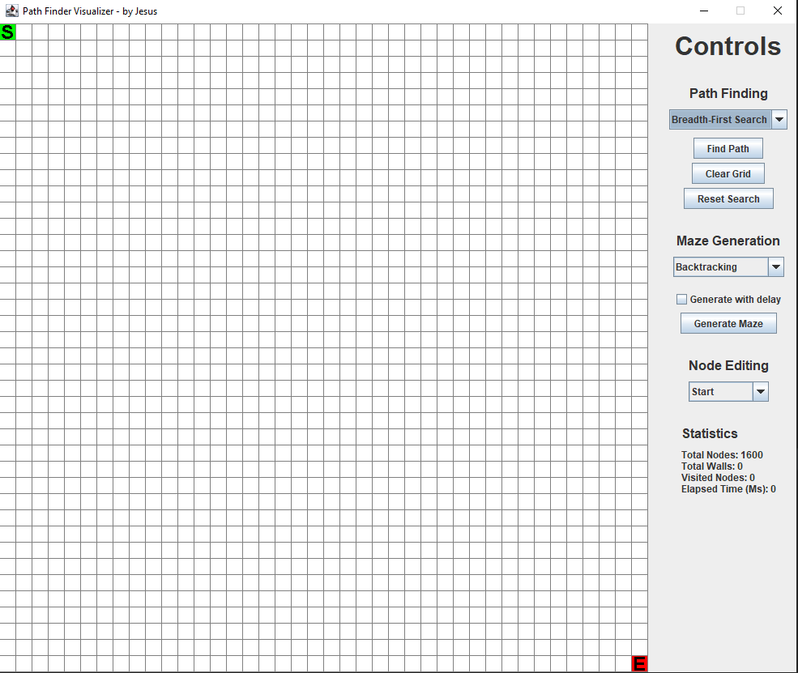
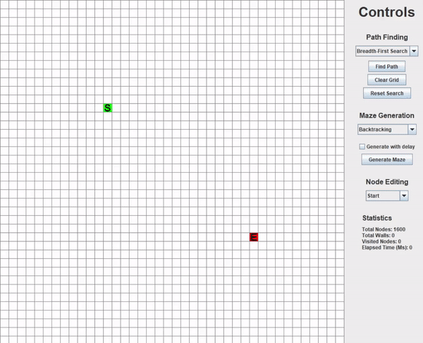
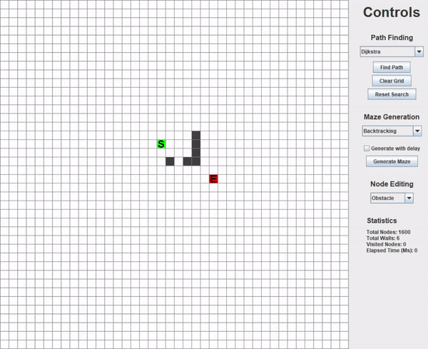
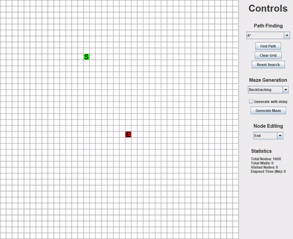
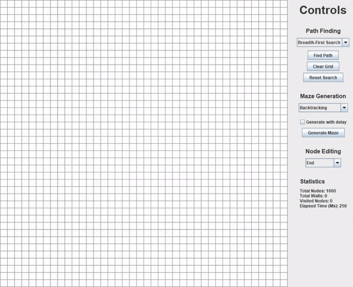
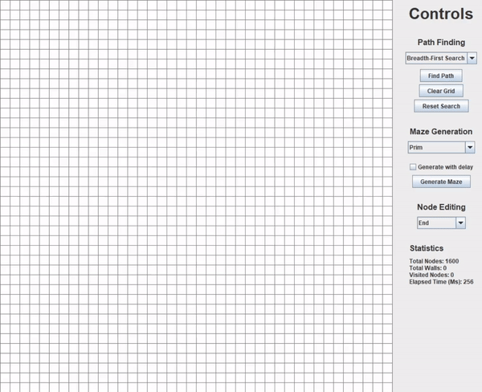

# PathFinder Visualizer

> This is a personal project that I created to get some hands on some algorithms I've been learning about recently at
> College.
> This project contains both pathfinding and maze generation algorithms, and I'll keep updating them as I go.

--- 

## Description

In this project I used Kotlin and Java Swing to build the GUI.
The app contains a control panel on the right and a grid on the left where the visualization will occur.

On the control panel you have 4 areas:

- Path Finding controls: where you can choose the PathFinding algorithm, click the button "Find Path" to start the
  search, clear the grid totally or reset the previous search.
- Maze Generation controls: here you can choose the algorithm to generate the maze and choose if you want to see the
  generation slowly or not.
- Node Editing: where you can select "Start" or "End" nodes to change their place in the grid; you can also add walls ("
  Obstacle").
- Statistics: here you can see the info about the grid, searches and maze generations.

I would like to mention two similar projects that I used as inspiration to implement the different algorithms and
controls:

- [PathFinding by André Páscoa](https://github.com/devandrepascoa/PathFinding)
- [Algorithm-Visualizer-JavaFX by Francisco Zacarias](https://github.com/FranciscoZacarias/Algorithm-Visualizer-JavaFX)

---

## PathFinding Algorithms

All of these algorithms introduce a distinct way to traverse the grid and to find the path from the start node to the
end node.

### Breadth-First Search

This algorithm finds the shortest-path between the start and end nodes.

It starts at the start node and explores all of its neighbours in the next level before moving to each of the root
children,
and then, it explores the neighbours of the root children, and so on.
The algorithm uses a queue to perform the BFS.

### Dijkstra Algorithm

Dijkstra's shortest path algorithm guarantees the shortest path between two nodes, like the BFS algorithm but with
weighted nodes.
Instead of using a simple queue, uses a priority queue to perform the search.

### A* Algorithm

The A* algorithm is known for its optimal efficiency.
It works based on a heuristic that tries to estimate the distance between the start node and the target node.
I've implemented the A* that stops immediately once it sees the target (which will not necessarily find the shortest
path, as it did not visit all the possible nodes).

---

## Maze Generation Algorithms

All of these algorithms introduce a distinct way to generate a possible maze.

You can also use the "Generate with delay" checkbox to generate the maze with some delay to see the algorithm working.

### Backtracker

This algorithm picks random directions in the grid to go to, as long as they have not been visited yet.
If it sees itself stuck, it backtracks itself to the last node with an available neighbour.

### Kruskal Algorithm

This algorithm is a twist on the Kruskal's algorithm for producing a minimal spanning tree from a weighted graph.
Instead of pulling edges with the lowest weight, we pull random walls and carve a path from there.

### Prim Algorithm

This algorithm, as well as the last one, has its original purpose on producing minimal spanning trees.
This approach differs from the previous by simply growing out of one point, instead of randomly growing throughout the
grid.

---

## Author Info

- LinkedIn - [André Jesus](https://www.linkedin.com/in/andre-jesus-engineering)
- Twitter - [@andre_j3sus](https://twitter.com/andre_j3sus)
- Website - [André Jesus](https://sites.google.com/view/andre-jesus/p%C3%A1gina-inicial)
